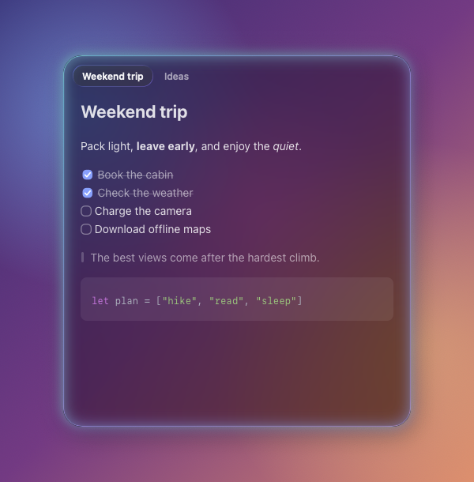

# Sidecar Note

[](https://github.com/tachibanayu24/sidecar-note/actions/workflows/build.yml)
[](LICENSE)


An always-on-top Markdown note for macOS that slides in from the edge of the screen — Liquid Glass, keyboard-first.

<p align="center"></p>

## Features

- **Always at hand.** Summon it with `⌃⇧Space` or a four-finger swipe down on any trackpad (built-in or Magic Trackpad); it floats above every app and slides back out of the way.
- **Live Markdown.** Headings, emphasis, lists, tasks, quotes, tables, links, images and syntax-highlighted code render as you type. Syntax characters only show on the line you're editing; the file stays plain Markdown.
- **Liquid Glass.** Built on Apple's glass, from crystal clear to frosted to tinted. A soft halo — a different sky each time — tells you it has focus.
- **Keyboard-first.** Lists continue on `Return`, `Tab` indents, `⌘↩` toggles tasks, and `⌘Z` even reopens a note you just closed.
- **Plain files.** Every note is a `.md` file, saved as you type.

## Install

Requires macOS 26 or later and Xcode 26 (Swift 6.2) to build.

```sh
git clone https://github.com/tachibanayu24/sidecar-note.git
cd sidecar-note
./scripts/build-app.sh --install   # builds, copies to /Applications and launches
```

The app lives in the menu bar (no Dock icon). It is ad-hoc signed, so build it on the Mac that runs it.

## Usage

### Summon

| | |
|---|---|
| `⌃⇧Space` (configurable) / four-finger swipe down | Show · focus (if visible but unfocused) · hide |
| `⌘H` | Hide |
| `⌘Q` twice | Quit (a single press only shows a hint) |

The note never appears over full-screen apps. While it has keyboard focus a soft halo glows around it; that halo is the only visual difference between focused and unfocused.

### Notes & tabs

| | |
|---|---|
| `⌘T` / `⌘W` | New note / close note (its file goes to the Trash) |
| `⌘Z` right after closing | Reopen the closed note (until you type anything; then `⌘Z` undoes text again) |
| `⌘1`…`⌘8`, `⌘9` | Go to a note, `⌘9` = last |
| `⌃Tab` / `⌃⇧Tab`, `⌘⇧]` / `⌘⇧[` | Next / previous note |
| Drag a tab | Reorder |

Tabs appear once there are two notes; with one note it's just the glass. Blank notes don't linger — they go away when you switch to another note or hide the panel.

### Editing

| | |
|---|---|
| `Return` in a list / task / quote | Continues it; on an empty item, outdents or ends the list |
| `Tab` / `⇧Tab` on list lines | Indent / outdent |
| `⌘↩` | Toggle the checkbox (turns plain lines, bullets and quotes into tasks) |
| Click a checkbox | Toggle it |
| `⌘B` `⌘I` `⌘⇧X` `⌘E` | Bold · italic · strikethrough · inline code |
| `⌘`-click a link | Open it |
| Paste / drop an image | Saved to `assets/`, shown inline |
| `⌘F`, `⌘G`, `⌘⇧G` | Find in note |
| `⌘+` `⌘-` `⌘0` | Text size |

### Settings (`⌘,`)

Shortcut, four-finger swipe, theme, focus glow, opacity (Apple's clear glass → regular glass → tinted), font, text size, notes folder, launch at login, menu bar icon.

### Files

Notes are plain `.md` files in `~/Library/Application Support/com.tachibanayu24.SidecarNote/Notes/` (changeable in Settings; existing notes move along). They are saved as you type and written back in the encoding they were read with. If another app changed a file while it had unsaved edits here, that version is kept next to it as `name (conflict yyyyMMdd-HHmmss).md`.

## How it works

| | |
|---|---|
| `PanelController` | The floating, non-activating panel (it takes the keyboard without activating the app, like Spotlight), Liquid Glass layers, slide animation, geometry |
| `FocusGlow` | Click-through child window drawing the shadow and the focus halo |
| `MarkdownStyler` | [swift-markdown](https://github.com/swiftlang/swift-markdown) AST → text attributes; syntax is dimmed or collapsed, never removed |
| `MarkdownLayoutManager` | Draws checkboxes, bullets, code panels, quote bars, rules and images |
| `Editor` | A TextKit 1 editor per note: list editing, commands, IME-safe restyling |
| `NoteStore` | Files, tabs, autosave, reopen-after-close |
| `GestureMonitor` + `CMultitouch` | Four-finger swipe from every trackpad via MultitouchSupport |

`Vendor/` holds [Highlightr](https://github.com/raspu/Highlightr) and [KeyboardShortcuts](https://github.com/sindresorhus/KeyboardShortcuts), patched so the app needs no SwiftPM resource bundles (SwiftPM's generated lookup can't find them inside a signed app): Highlightr loads its assets from `Contents/Resources/Highlightr.bundle`, and KeyboardShortcuts has its English strings compiled in.

## Limitations

- The four-finger swipe and the focus-independent glass look rely on private macOS APIs (MultitouchSupport and AppKit appearance hooks). That rules out the Mac App Store, and a future macOS update could break them.
- Every keystroke re-parses the note; very long notes (hundreds of KB) may feel slower.

## Development

```sh
swift build                        # compile
./scripts/build-app.sh             # build/Sidecar Note.app
./scripts/build-app.sh --dev       # "Sidecar Note Dev.app": its own bundle id, settings and notes
swift scripts/make-icon.swift      # regenerate the icon
```

The dev app never takes the keyboard and writes to `/tmp/sidecar-dev.log`. When it receives the distributed notification `SidecarNoteDev.selftest` it runs an in-process self-test of the editor commands, styling and store.

See [CONTRIBUTING.md](CONTRIBUTING.md).

## License

[MIT](LICENSE). Vendored dependencies keep their own licenses: [Highlightr](Vendor/Highlightr/LICENSE) (MIT) with [highlight.js](Vendor/Highlightr/src/assets/highlighter/LICENSE) (BSD-3-Clause), and [KeyboardShortcuts](Vendor/KeyboardShortcuts/license) (MIT).
